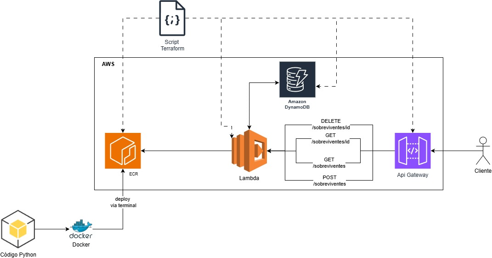
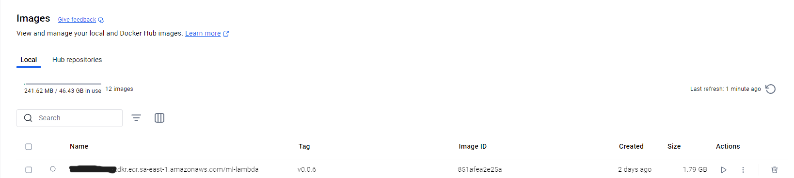
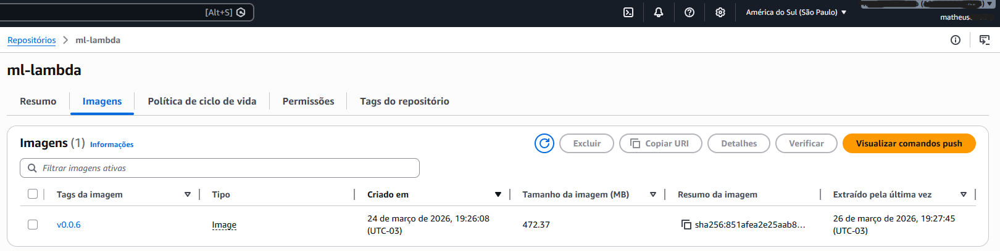
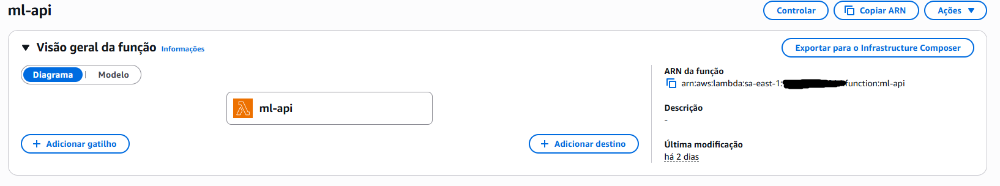
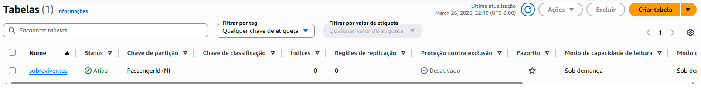
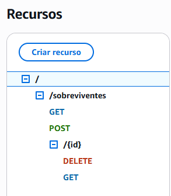
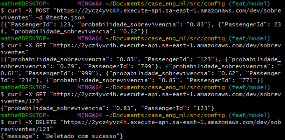

# Case Seleção

## Software Engineer Python - AWS

### Tarefas

1. Criar um repositório no Github que deve conter todos com os códigos do case;
2. Criar o código que sobe uma API usando IaC (com Terraform, por exemplo), preferencialmente usando o serviço API Gateway da Cloud AWS:
   - O contrato deve ser especificado usando o OpenAPI 3.0 (Swagger)
   - Deve expor um endpoint com um recurso */sobreviventes* que recebe um JSON com um array de características necessárias para escorar o modelo de Machine Learning treinado em cima do Dataset do Titanic. O modelo é disponibilizado neste repositório na seguinte *path*: */modelo/model.pkl*;
   - O método POST deve receber um JSON no body com um array de características e retornar um JSON com a probabilidade de sobrevivência do passageiro, junto com o ID do passageiro;
     - O processamento - escoragem - deve ser feita numa função Lambda **com código escrito em Python**, e caso seja escolhido outro serviço AWS, justificar a escolha;
     - Além disso, a probabilidade de sobrevivência pode ser armazenada em um banco de dados de baixa latência e serverless - DynamoDB;
     - O Banco de Dados e a função Lambda devem ser criados usando IaC com Terraform, por exemplo;
     - **Não provisionar o banco DynamoDB, dado o baixo volume de requisições que serão feitas;**
   - O método GET /sobreviventes deve retornar um JSON com a lista de passageiros que já foram avaliados (fica a critério do candidato implementar paginação ou não);
   - O método GET /sobreviventes/{id} deve retornar um JSON com a probabilidade de sobrevivência do passageiro com o ID informado;
   - O método DELETE deve deletar o passageiro com o ID informado;
3. Disponibilizar os arquivos de IaC (Terraform) no repositório, assim como o contrato OpenAPI e o código da função Lambda;
4. Você possui o prazo de 7 dias corridos para entrega do case, uma vez recebido o link para este repositório;

# Projeto Desenvolvido

## Introdução
O objetivo do projeto é construir um sistema que tenha disponível 4 rotas, sendo uma POST de chamada de um modelo de Machine Learning, onde a partir de um payload, recebo a probabilidade e o id do passageiro. Outras 2 rotas de consumo do DynamoDB, uma para listagem de passageiros e outra para pesquisa de um único passageiro. E por fim, teremos uma rota para deletar passageiros através do ID.

O projeto é seguido pela seguinte arquitetura:


## 1. Configuração do ambiente usando o .toml
Construção da ENV:
  ```bash
    python venv .env_modelo
  ```
  ```bash
    .env_modelo\Scripts\activate
  ```
Instalação do .toml:
  ```bash
    pip install -e .
  ```
## 2. Construção do pipeline do modelo
Para construção da pipeline, é necessário o .pkl do modelo treinado e as etapas de tratamento do dado.
O script [Gerador de Artefatos](./src/model/generate_artfacts.py) gera a pipeline do modelo para consumo da lambda.

## 3. Construção do código python para execução em lambda 
É necessário criar um script para consumo do modelo e dos dados no Dynamo. Para isso, o script [Lambda Handler](./src/app.py), foi criado com o intuíto de fazer essas ações. Para teste da funcionalidade, pode ser utilizado os seguintes payloads no Lambda [Exemplos Json](./src/config/event.json).

## 4. Criação de imagem docker
Para criação do Container, estou utilizando o Docker. Ele será o responsável por empacotar o projeto, utilizando o arquivo [PyProject](pyproject.toml) como base de versionamento do Python e libs. O código de configuração do container está disponível aqui [DockerFile](./Dockerfile).


Script de criação da imagem:
  ```bash
    docker buildx build --platform linux/amd64 -t ml-lambda --load .
  ```
Teste da imagem:
  ```bash
    # Executa a imagem
    docker run -p 9000:8080 ml-lambda
    
    # Teste da imagem em outro terminal (deixe apenas o payload que irá usar no event.json).
    curl -XPOST "http://localhost:9000/2015-03-31/functions/function/invocations/sobreviventes" -d @event.json
  ```



## 5. Construção do Terraform de subida de lambda no ECR
Um dos requisito é que todos as implementações sejam em IaC. Escolhi o método via terraform.

A construção dos terraform foram realizadas de forma apartadas, cada uma está separada em uma pasta:
- [ECR](./src/terraform/ecr/)
- [LAMBDA](./src/terraform/lambda/)
- [DYNAMO](./src/terraform/dynamo/)
- [API GATEWAY](./src/terraform/api_gateway/)

Para criação da imagem, basta executar os comandos abaixo, a partir da raiz do projeto:
  ```bash
    cd src/terraform/ecr
    terraform init
    terraform apply
  ```

Subida de imagem no ECR:
  - atualizar o aws configure
Executar o comando para login no ECR:
  ```bash
    aws ecr get-login-password --region sa-east-1 | docker login --username AWS --password-stdin 123687089814.dkr.ecr.sa-east-1.amazonaws.com
  ```
Executar a implementação no docker:
```bash
  # Atualize a versao da imagem
  docker tag ml-lambda:latest 123687089814.dkr.ecr.sa-east-1.amazonaws.com/ml-lambda:{versao}

  # Esse comando irá subir o script no ECR
  docker push 123687089814.dkr.ecr.sa-east-1.amazonaws.com/ml-lambda:{versao}
```


## 6. Subida do lambda via terraform
Criação da lambda:
  ```bash
    cd src/terraform/lambda
    terraform init
    terraform apply
  ```
Atualização da imagem (caso seja a partir do segundo commit):
  - altere a versão no arquivo [Variáveis Lambda](./src/terraform/lambda/variables.tf).
  - Execute os comandos abaixo:
    ```bash
      cd src/terraform/lambda
      terraform init
      terraform apply -target=aws_lambda_function.lambda
    ```



## 7. Construção do Terraform de subida de Dynamo.
O Dynamo, será o responsável por armazenar os resultados gerados pelo método POST da lambda.
- Execute os comandos abaixo:
  ```bash
    cd src/terraform/dynamo
    terraform init
    terraform apply
  ```



## 8. Construção da API e API GateWay
- OpenAPI 3.0 (Swagger)
  - É um documento que explica exatamente como a API funciona. Define tipagem, rotas e padrões de saída.
  - [OpenApi.yaml](./src/terraform/api_gateway/openapi.yaml)



### 8.1 Construção do Terraform de subida de API GateWay
O API GateWay será responsável por fazer as chamadas do lambda de forma externa. Essa API pode ser consumida por outros sistemas.

- Via Terraform será construída a API GateWay:
  ```bash
    cd src/terraform/api_gateway
    terraform init
    terraform apply 
  ```

Rotas para chamada da API:
```bash
  - curl -X POST "https://2ycz4yvc4h.execute-api.sa-east-1.amazonaws.com/dev/sobreviventes" -d @teste.json
  - curl -X GET "https://2ycz4yvc4h.execute-api.sa-east-1.amazonaws.com/dev/sobreviventes"
  - curl -X GET "https://2ycz4yvc4h.execute-api.sa-east-1.amazonaws.com/dev/sobreviventes/123"
  - curl -X DELETE "https://2ycz4yvc4h.execute-api.sa-east-1.amazonaws.com/dev/sobreviventes/123"
```

